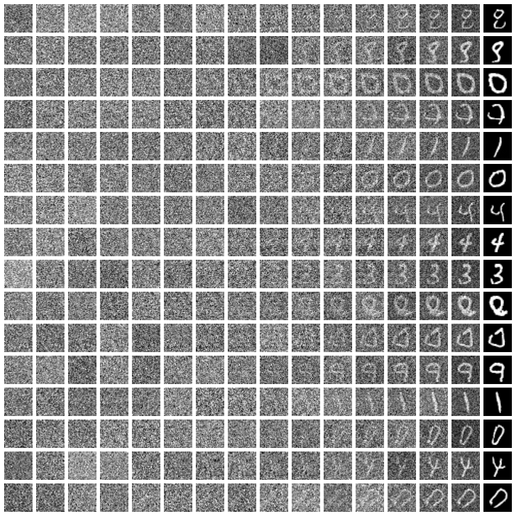
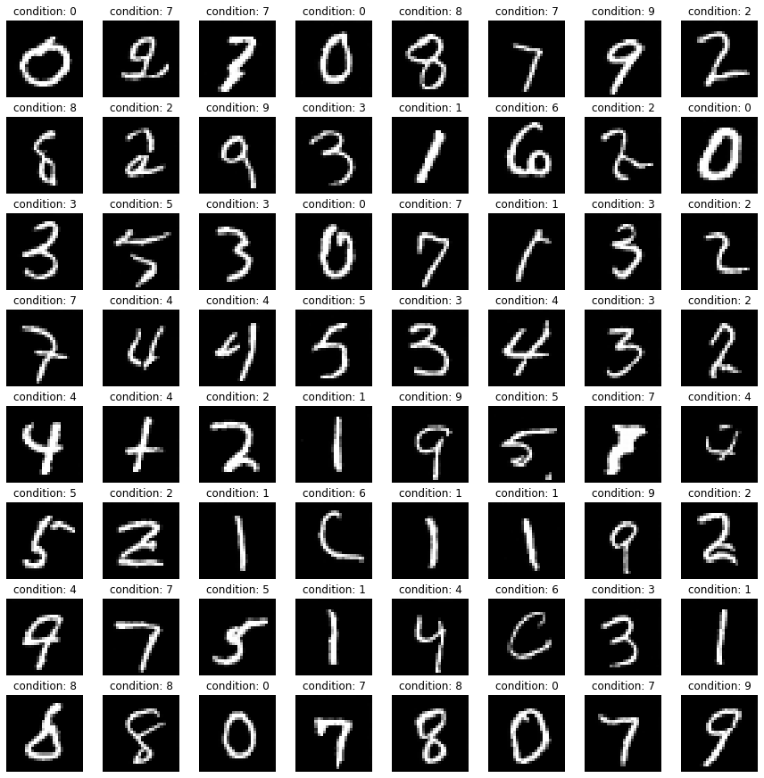
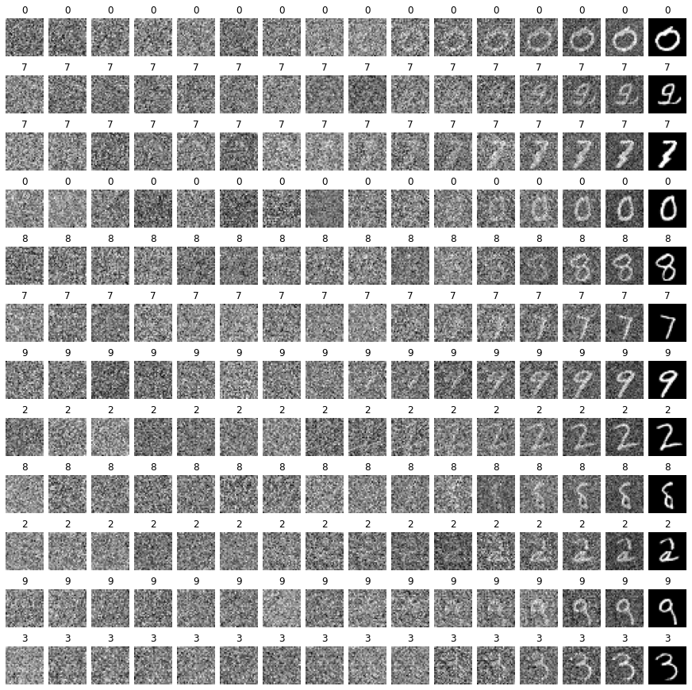

# PyTorch-DDPM

500 行代码用 PyTorch 实现降噪扩散模型 DDPM

如何实现？可参考个人精简后的公式： https://timecat.notion.site/DDPM-b8e2a91927d249fdbcf7c82f2eb6f846

## DDPM

从随机噪声中降噪生成图片

## Classifier-Free DDPM

条件控制 DDPM：给定一个数字，根据数字生成图片

